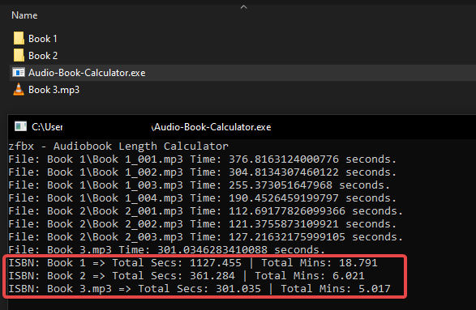

# Audio Book Calculator
I built this as a useful tool at work to sum up the total runtime of a collection of mp3 files that was needed for uploading audiobooks to one of our providors but is no longer needed. This project ended up saving many tens of hours of time. This was my **first** ever Go project that I built in about an hour back in June of 2023. *The title is only spaced like it is because it's makes the acronym "ABC" which is silly.

## Usage
*Files are grouped together by their name before the first underscore `_`. so normally we would label audiobooks with the isbn then chapter (example: `978-1-01-123456-0_1.mp3`) but `any title_001.mp3` would work.*
- Drop the compiled executable in a directory and run it.
- It will scan through all the directories and group together titles with their total seconds and minutes

## Preview

## License
GPLv3

