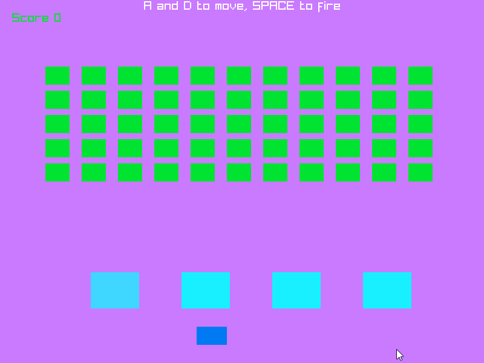

# Zig Invaders
This project started out as my first deep dive into zig on version `0.15.2` utilizing raylib `5.6.0-dev`. Inspired by [space invaders](https://en.wikipedia.org/wiki/Space_Invaders)

## Note and Thanks
This project was built with the help of [this series](https://www.youtube.com/playlist?list=PLYA3HD4nElQnxWnznih9w0RloSw0hFaYQ) by [@bradcypert](https://github.com/bradcypert). If you are thinking about using my project as a help through this course, I wouldn't. I did not follow along exactly as he did. Here are some key differences:
- Use of `i32` over `f32` where possible for less casting.
- Abusing `struct` for default values.
- Making use of `std.math` for `clamp` > `if` statements.
- Using "Composition" (Duck typing?) for fake inheritence.
- Returning early where possible (see [Never nesting](https://www.youtube.com/watch?v=CFRhGnuXG-4))

Check out his [YouTube](https://www.youtube.com/@CodeWithCypert) and subscribe :) He only has 7.8K subscribers as I write this.

